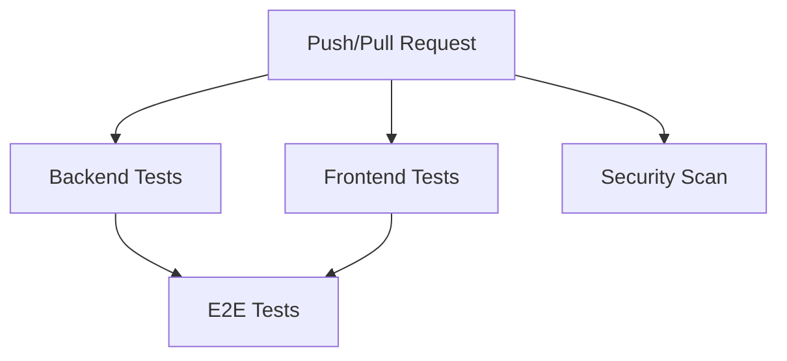

# GitHub Actions CI/CD Setup

This document describes the GitHub Actions workflow setup for Gaming Night, including backend testing, frontend testing, end-to-end testing, and security scanning.

## Table of Contents

- [Overview](#overview)
- [Workflow Structure](#workflow-structure)
- [Backend Tests](#backend-tests)
- [Frontend Tests](#frontend-tests)
- [End-to-End Tests](#end-to-end-tests)
- [Security Scanning](#security-scanning)
- [Setup Instructions](#setup-instructions)
- [Customization Options](#customization-options)
- [Troubleshooting](#troubleshooting)

## Overview

Gaming Night uses GitHub Actions for continuous integration with a comprehensive testing pipeline that runs on every push and pull request to `main` and `develop` branches.

**Workflow File**: `.github/workflows/ci.yml`

**Pipeline Jobs**:
1. **Backend Tests** - Maven tests with PostgreSQL service container
2. **Frontend Tests** - Vitest with React Testing Library
3. **E2E Tests** - Cypress end-to-end tests (depends on backend/frontend jobs)
4. **Security Scan** - OWASP dependency-check for vulnerability detection

## Workflow Structure



The E2E tests depend on both Backend and Frontend tests completing successfully.

## Backend Tests

### Configuration
- **Trigger**: Runs on push/pull request to main/develop
- **Environment**: Ubuntu latest
- **Java**: JDK 21 (Temurin distribution)
- **Database**: PostgreSQL 16 service container
- **Build Tool**: Maven with dependency caching

### Test Execution
```yaml
# Environment variables for Spring Boot
SPRING_DATASOURCE_URL: jdbc:postgresql://localhost:5432/gaming-night
SPRING_DATASOURCE_USERNAME: gaming-night
SPRING_DATASOURCE_PASSWORD: gaming-night
```

### Commands
```bash
cd backend
mvn test -Dtest="*Test,*Spec" -DfailIfNoTests=false
```

### Includes
- Domain model tests
- Use case service tests with mocked ports
- Controller tests with `@WebMvcTest`
- Persistence tests with Testcontainers (if Docker available in CI)

## Frontend Tests

### Configuration
- **Trigger**: Runs on push/pull request to main/develop
- **Environment**: Ubuntu latest
- **Node.js**: Version 20
- **Build Tool**: npm with dependency caching

### Test Execution
```bash
cd frontend
npm ci          # Clean install
npm test        # Run Vitest tests
```

### Includes
- Component tests with React Testing Library
- Form validation tests
- Navigation tests
- API client tests

## End-to-End Tests

### Configuration
- **Trigger**: Runs after Backend and Frontend tests pass
- **Environment**: Ubuntu latest
- **Java**: JDK 21 for backend
- **Node.js**: Version 20 for frontend
- **Database**: PostgreSQL 16 service container
- **Testing Framework**: Cypress

### Setup Process
1. **Database**: PostgreSQL service container starts
2. **Dependencies**: Install frontend dependencies
3. **Build**: Create production build of frontend
4. **Cypress**: Install Cypress as dev dependency
5. **Backend**: Start Spring Boot server in background
6. **Frontend**: Start Vite preview server in background
7. **Tests**: Run Cypress in headless mode

### Test Execution
```bash
# Backend server
cd backend
mvn spring-boot:run &
sleep 60  # Wait for Spring Boot startup

# Frontend server  
cd frontend
npm run preview &
sleep 10  # Wait for Vite preview

# Cypress tests
cd frontend
npx cypress run --headless --browser chrome
```

### Test Coverage
- User authentication flows
- Competition creation and management
- Player and team management
- Game setup and scoring
- Leaderboard functionality
- Cross-browser compatibility

## Security Scanning

### Configuration
- **Trigger**: Runs on push/pull request to main/develop
- **Tool**: OWASP dependency-check Maven plugin
- **Threshold**: Fails build on CVSS 7+ vulnerabilities

### Execution
```bash
cd backend
mvn dependency-check:check
```

### Features
- Scans all dependencies for known CVEs
- Uses suppression file for false positives (`backend/owasp-suppressions.xml`)
- Fails build if critical/high vulnerabilities found
- Reports detailed vulnerability information

## Setup Instructions

### Step 1: Create GitHub Actions Directory
```bash
mkdir -p .github/workflows
```

### Step 2: Add Workflow File
Create `.github/workflows/ci.yml` with the content from this repository.

### Step 3: Commit and Push
```bash
git add .github/workflows/ci.yml
git commit -m "Add GitHub Actions CI workflow"
git push origin main
```

### Step 4: Verify Setup
1. Go to your GitHub repository
2. Click on "Actions" tab
3. The workflow should automatically run on the next push

## Customization Options

### Trigger Configuration
To change when the workflow runs, modify the `on:` section:

```yaml
on:
  push:
    branches: [ main, develop, feature/* ]  # Add more branches
  pull_request:
    branches: [ main ]                    # Only on PR to main
  schedule:
    - cron: '0 0 * * *'                 # Daily at midnight
```

### Environment Variables
Add secrets in GitHub repository settings for production credentials:

```yaml
# In your workflow
env:
  SPRING_DATASOURCE_URL: ${{ secrets.SPRING_DATASOURCE_URL }}
  SPRING_DATASOURCE_USERNAME: ${{ secrets.DB_USERNAME }}
  SPRING_DATASOURCE_PASSWORD: ${{ secrets.DB_PASSWORD }}
```

### Matrix Testing
Add matrix strategy for multiple Java/Node versions:

```yaml
strategy:
  matrix:
    java: ['21']
    node: ['20', '22']
```

### Artifact Storage
Save test reports and build artifacts:

```yaml
- name: Upload test results
  uses: actions/upload-artifact@v4
  with:
    name: test-results
    path: |
      backend/target/surefire-reports/
      frontend/test-results/
```

## Troubleshooting

### Common Issues

#### 1. Database Connection Failed
**Symptom**: Backend tests fail with database connection errors
**Solution**: Check PostgreSQL service container is running and credentials match

#### 2. Out of Memory Errors
**Symptom**: Java process killed due to memory limits
**Solution**: Add memory configuration:
```yaml
- name: Run backend tests
  run: mvn test -Xmx2g
```

#### 3. Cypress Tests Failing
**Symptom**: E2E tests fail due to timing issues
**Solution**: Increase wait times or add proper element waiting:
```bash
# In Cypress tests
cy.get('[data-testid="element"]').should('be.visible')
```

#### 4. Dependency Cache Miss
**Symptom**: Slow builds due to missing cache
**Solution**: Verify cache keys and paths in workflow

#### 5. Spring Boot Startup Timeout
**Symptom**: Backend server doesn't start in time
**Solution**: Increase sleep time or add health check:
```bash
# Add health check
curl -f http://localhost:8080/actuator/health || exit 1
```

### Debugging Workflows

1. **View Logs**: Go to Actions tab → Click on workflow run → View step logs
2. **Enable Debug**: Add `ACT=debug` secret to see detailed GitHub Actions logs
3. **Local Testing**: Run workflow locally using [act](https://github.com/nektos/act)

```bash
# Install act
npm install -g act

# Run workflow locally
act -j backend-test
```

## Performance Optimization

### Caching Strategies
```yaml
# Maven cache
- uses: actions/cache@v3
  with:
    path: ~/.m2/repository
    key: ${{ runner.os }}-maven-${{ hashFiles('**/pom.xml') }}

# npm cache  
- uses: actions/cache@v3
  with:
    path: ~/.npm
    key: ${{ runner.os }}-npm-${{ hashFiles('**/package-lock.json') }}
```

### Parallel Jobs
The workflow already runs backend and frontend tests in parallel, then E2E tests after they complete.

### Test Selection
Run specific test groups:
```bash
# Backend - only domain tests
mvn test -Dtest="*DomainTest"

# Backend - only controller tests  
mvn test -Dtest="*ControllerTest"

# Frontend - specific test file
npm test -- GameForm.test.tsx
```

## Monitoring and Notifications

### Slack Notifications
Add Slack integration for workflow results:

```yaml
- name: Notify Slack on failure
  if: failure()
  uses: rtCamp/action-slack-notify@v2
  env:
    SLACK_WEBHOOK: ${{ secrets.SLACK_WEBHOOK }}
    SLACK_COLOR: danger
    SLACK_TITLE: "Gaming Night CI Failed"
```

### Email Notifications
Configure in GitHub repository settings under "Manage notifications".

## Deployment Integration

The CI workflow can be extended to include deployment:

```yaml
deploy:
  name: Deploy to Production
  runs-on: ubuntu-latest
  needs: [backend-test, frontend-test, e2e-test, dependency-check]
  if: github.ref == 'refs/heads/main'
  
  steps:
    - name: Deploy backend
      run: ./deploy-backend.sh
    
    - name: Deploy frontend
      run: ./deploy-frontend.sh
```

## Security Considerations

### Secrets Management
- Never hardcode credentials in workflow files
- Use GitHub Secrets for sensitive data
- Rotate secrets regularly
- Limit access to secrets

### Permissions
The workflow uses default permissions. For production, consider:

```yaml
permissions:
  contents: read
  packages: read
  # Only needed for deployment jobs
  deployments: write
```

### Code Scanning
GitHub provides additional security features:
- CodeQL analysis (built-in)
- Secret scanning
- Dependency graph

Enable these in repository settings under "Security" tab.

## Maintenance

### Update Dependencies
Regularly update action versions:

```yaml
# Check for updates at https://github.com/marketplace?type=actions
- uses: actions/checkout@v4        # Latest as of 2026
- uses: actions/setup-java@v4      # Latest as of 2026
- uses: actions/setup-node@v4      # Latest as of 2026
```

### Monitor Test Performance
- Track test execution times
- Identify and fix slow tests
- Consider test parallelization for large test suites

### Clean Up Old Workflow Runs
GitHub retains workflow runs for 90 days by default. Clean up old runs to save storage:

```bash
# List old runs (via GitHub API)
# Delete old runs manually via GitHub UI
```

## References

- [GitHub Actions Documentation](https://docs.github.com/en/actions)
- [Cypress GitHub Actions](https://on.cypress.io/ci-changes#github-actions)
- [OWASP Dependency-Check](https://owasp.github.io/dependency-check/)
- [Spring Boot Testcontainers](https://www.testcontainers.org/modules/databases/postgres/)

## Support

For issues with the GitHub Actions setup:
1. Check the workflow logs in GitHub Actions tab
2. Review this documentation for common issues
3. Consult the official documentation links above
4. Create an issue in the repository for persistent problems